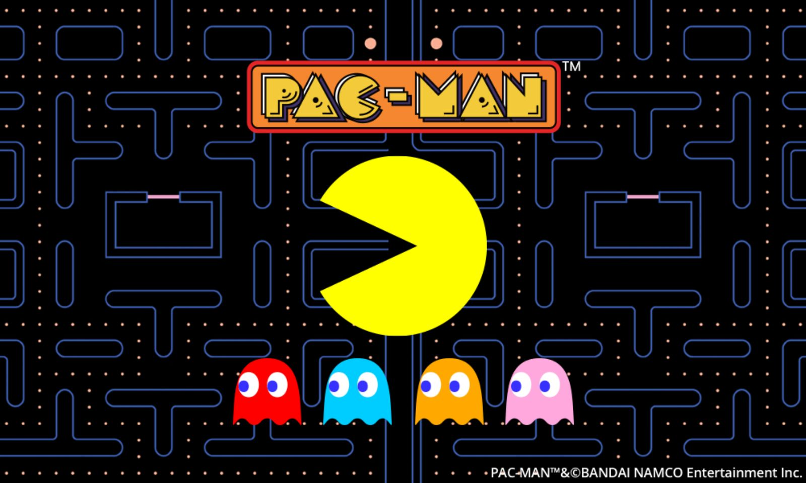

# paQman: Optimizing Bin-Packing For Sustainability

## The Problem

Our team aims to tackle the issue of inefficient supply-chain packing systems.

The following code cells contain optimization algorithms for bin packing. The bin packing problem goes as follows:

Suppose you are given a finite collection of n weights w1, w2, w3, ... , wn, and a collection of identical bins with capacity C (which exceeds the largest of the weights). What is the minimum number k of bins into which the weights can be placed without exceeding the bin capacity C? [http://www.ams.org/publicoutreach/feature-column/fcarc-bins1]

Our team has applied this problem in the scenario of trucking in the supply chain. We use the following hybrid algorithm (classical and quantum components) in order to address this issue.

The optimization algorithms we used are derived from Qiskit's Variational Quantum Eigensolver (VQE) library and Quantum Approximate Optimization Algorithm (QAOA).

Furthermore, we implemented a computer vision model to detect the dimensions of a box given a known measure. Then we use this to calculate the area of the box and using this area determine the weights for each individual item that will be optimized into bins using the bin packing problem.
